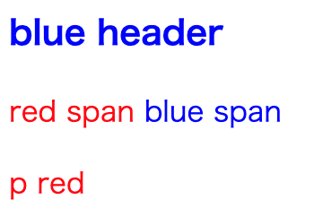

# スタイル指定の基本形とセレクタ

## 基本となるスタイル

スタイルの基本構文は次の通りです。

```css
セレクタ {
    設定名: 値;
}
```

## セレクタ

セレクタは、スタイルを適用するための条件式を記載します。
セレクタに記載した条件に合致したHTML要素に対して、スタイルが適用されます。

### 要素名セレクタ

pタグやaタグなど、タグの要素名から指定することができます。

例として、aタグの要素を変更します。

```css
a {
    color: red;
    font-size: large;
}
```

こうすることで、全てのa要素に対して上記のスタイルが適用されます。

### クラス名を指定しての指定

特定の要素にのみ指定を行いたい場合、クラス名を指定してスタイルを記載します。

```css:style.css
.red {
    color: red;
}

.green{
    color: green;
}
```

```html:index.html
<html>
<body>
    <div class="red">Red</div>
    <p class="green">Green</p>
</body>
</html>
```

クラス指定する場合には、要素に関わらず指定することができます。

ただし、例えば非インライン要素に対するvertical-alignなど、
要素によっては適用されない場合があります。

## 複数の要素からセレクタを構成する

セレクタを指定する際に、複数の条件を使用してセレクタとすることができます。

例として、「文字を赤くする」ための記載をします。

```css
div.red {
    color: red;
    font-weight: bold;
}

a.red {
    color: red;
    font-size: large;
}
```

```html:index.html
<html>
<body>
    <div class="red">Red</div>
    <br/>
    <a class="red">Red</a>
</body>
</html>
```

この場合、同じclass="red"を指定した場合でも、
divタグは文字が太くなり、aタグは文字が大きくなります。

このように、同じクラス名を使用する場合でも、
要素ごとに違った挙動をさせることができます。

## 特定の要素のさらに子要素を指定する


CSSでは、複数の条件を指定することで子要素も含めたスタイルを指定できます。

◆ CSS

```css
div .red {
  color: red;
}
div .blue {
  color: blue;
}
```

◆ HTML

```html
<div >
  <h3 class="blue">blue header</h3>
  <span class="red">red span</span>
  <span class="blue">blue span</span>
  <p class="red">p red</p>
</div>
```

これを表示してみましょう。




このように、divの中に配置された各要素の色が変わっていることがわかります。

```css
div .red
```

このセレクタは、``div``要素の中にある``.red``クラスを指定した要素に対してスタイルを反映します。
この際、``div``と``.red``の間にはスペースを入れることが大事です。

もちろん、以下のようにさらに細かい指定をすることも可能です。

```css
div span.red
```
