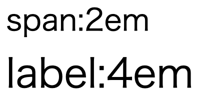

## 大きさとサイズの指定

CSSでは、大きさを指定するためにいくつかの方法があります。

本項では、その指定方法について学習します。

### ピクセル指定

もっとも基本となる大きさの基準で、ピクセル数で要素の大きさを指定します。

ブラウザの拡大などが発生した場合でも大きさは固定されますので、

絶対にレイアウトを崩したく無かったり、利用する画面サイズが固定されている場合に用います。

```css
.style {
  width: 400px;
  height: 300px;
}
```

この例では、要素の大きさを横幅400px、高さ300pxに固定しています。

### ピクセル指定の弱点

ピクセル指定は計算が簡単な反面、変化にとても弱くなります。

利用するPCが固定されている業務アプリケーションならまだ問題は発生しにくいですが、

スマートフォンやタブレットも意識すると、
スマートフォンが240px、PCの画面だと1920px（フルHD）に対応することが必要です。

また、同じPCでもOSの機能で拡大機能があったりするとさらに考慮すべき点が増えてしまいます。

これら向けのサイトをいちいち指定していては大変です。
そのため、ピクセル指定は一部分に制限し、次に紹介する相対指定を使用することが多くなりました。

### パーセント指定

親要素に対してのパーセント比率で指定します。

```css
div {
  width: 600px;
}
div p {
  width: 60px;
}
```

この例では、親要素が600pxに対し、子要素のpはその60%が指定されています。
つまり、このdiv要素の横幅は``600 * 0.6 = 360px``となります。

### em / rem指定

余白などを設定する場合に、「○文字ぶん」という指定をしたい場合があります。

そんな時に役立つのがemとremです。

emは"親要素からの"相対サイズ、remは"ルート（html）要素からの"相対サイズを指定します。

例として、次のCSSを考えてみます。

◆ CSS

```css
html {
  font-size: 10px;
}

div {
  font-size: 2em;
}

div span {
  font-size: 1.5em;
}

div label {
  font-size: 4rem;
}
```

◆ HTML

```html
<body>
  <div>
    <span>span:2em</span>
    <br>
    <label>label:4em</label>
  </div>
</body>
```

この時の表示を確認してみましょう。



spanの文字サイズは30px, labelの文字サイズは40pxになっています。

span要素は、親要素であるdivの、divは親要素であるhtmlの要素を元にサイズが確定しますので、以下のような計算になります。

> html：10px
>  div : 10px * 2em = 20px
>    span : 20px * 1.5em = 30px

一方で、rem指定はルート要素（html）に指定したサイズからの相対サイズとなるため、

> 10px * 4rem = 40px

という計算になります。

### viewport（ビューポート）による指定

近年では、モバイルファーストやレスポンシブ対応が基本となってきました。

これらに対応する場合には、
画面の大きさに応じたサイズ指定をしたい場合があります。

この画面サイズに対応したサイズ指定を行うための指定がビューポートです。

ビューポートを指定する場合には以下の4つを使用することになります。

|設定値|説明|
|---|---|
|vh|ビューポートに対する高さ|
|vw|ビューポートに対する幅|
|vmin|ビューポートの幅と高さのうち小さい方|
|vmax|ビューポートの幅と高さのうち大きい方|

ビューポート指定の場合、基準（画面いっぱい）を100とします。
たとえば、画面の横幅いっぱいを指定したい場合には、

```css
width: 100vw;
```

### パーセントやピクセル指定との使い分け

複数の指定方法がありますが、何を基準とするかによって使い分けることが大事です。

ビューポート指定は画面全体を基準としますので、主に背景などを取り扱いたい場合に有効です。

ピクセル指定は絶対値を用いるため指定が簡単である一方で画面サイズが変わった場合の変化に弱炒め、形が決まっているアイコンやロゴなどの取扱いに向いています。

パーセント指定は親要素の大きさを継承するため、半々で表示する場合などの大枠に利用できますが、計算などで端数が発生した場合には余分な余白やズレを生み出す場合があります。
