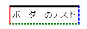

# 文字を操作する

\newpage

## 色を変更する

色を指定するためには、``color:``という項目名を利用するという説明をしました。

本項では、複数ある色の指定方法について学習します。

### 色名指定

CSSでは色名指定で表示できる色が用意されており、色の名称を指定することでその色を表示します。

以下に基本色となる16色を示します。

| |色名|RGB値|
|:--|--|--|
| \color[HTML]{00FFFF} ■ |aqua|#00FFFF|
| \color[HTML]{000000} ■ |black|#000000|
| \color[HTML]{0000FF} ■ |blue|#0000FF|
| \color[HTML]{FF00FF} ■ |fuchsia|#FF00FF|
| \color[HTML]{808080} ■ |gray|#808080|
| \color[HTML]{008000} ■ |green|#008000|
| \color[HTML]{00FF00} ■ |lime|#00FF00|
| \color[HTML]{800000} ■ |maroon|#800000|
| \color[HTML]{000080} ■ |navy|#000080|
| \color[HTML]{808000} ■ |olive|#808000|
| \color[HTML]{800080} ■ |purple|#800080|
| \color[HTML]{FF0000} ■ |red|#FF0000|
| \color[HTML]{C0C0C0} ■ |silver|#C0C0C0|
| \color[HTML]{008080} ■ |teal|#008080|
| \color[HTML]{FFFFFF} ■ |white|#FFFFFF|
| \color[HTML]{FFFF00} ■ |yellow|#FFFF00|

他にも、「拡張された色名」が124色存在しますが、ここでは説明を省略します。

### 16進数による指定

16進数を用いて、RGBの各値を0~FF(255)の範囲で表現することで、色の指定を行うことができます。

### rgb() / rbga()による指定

RGB値を10進数で指定したい場合には、rgb()関数を使用します。

```css
selector {
    color: rgb(255,0,0);
}
```

また、rgbaという関数を使用することで透明度（アルファ値）を指定できます。
透明度は第4引数で指定し、0 ~ 1の間で指定し、値が小さいほど透明度が高くなります。

```css
selector {
  color: rgba(255, 0, 0, 0.6);
}
```

## フォントを指定する

本項では、表示する文字に関する指定を学習します。

### font-family

フォント名を指定することで、
そのフォントで文字を表示させることができます。

フォント名を指定することでそのフォントに変更できますが、
<u>ブラウザがインストールされた**OSに存在しないフォント**を指定した場合には変更されません。</u>

とくに、MS〇〇やメイリオはWindows用のフォントです。
そのため、各OSに合わせて複数のフォントを指定するのが一般的です。

フォントの指定は以下のように複数個列挙できます。
以下の例では、MSゴシックがインストールされたWindowsPCではMSゴシックが、
それ以外のOSではsans-serifというフォントが適用されます。

```css
style {
  font-family: "MS ゴシック",sans-serif;
}
```

### font-weight

フォントの太さを指定できます。

100〜900の100刻み、もしくは以下の文字列で表現できます。

- normal（通常、400相当）
- bold（太め、700相当）
- lighter（親要素の指定より1段階太い）
- bolder（親要素の指定より一段階細い）

```css
style {
  font-weight: bold;
}
```

実際に数値を使用する際、100〜900の数値指定をしてもあまり太さに変化のない場合があります。
これは、フォントがすべての太さに対応していないためです。

100~1000のすべてに対応したフォントは珍しく、normal,boldにのみ対応したフォントがほとんどです。

### font-style

フォントのスタイルを指定できます。

スタイルは以下の中から指定できます。

- normal（通常）
- italic（イタリック体）
- oblique（斜体）

```css
style {
  font-style: italic;
}
```

イタリック体は筆記体調に変形したもの、斜体はそのまま斜めに傾けたものを指します。

ほとんどの場合、normalまたはitalicを使用します。

イタリック体も斜体も対応しているかどうかはフォント次第ですので、指定しても変形されない場合があります。
とくに日本語フォントの場合イタリック体は用意されていない場合が多く、
イタリックを指定しても斜体と同じ文字が表示されます。

そのため、とくに日本ではイタリック体＝斜体として扱われる場合もあります。

## テキストの位置指定

CSSを用いて、子要素を位置を上下左右に寄せることができます。

### 左右に寄せる - text-align

テキストの左右位置を調整するには、text-alignを使用します。

よく使用される値は以下の通りです。

|値| 説明|
|--|--|
|left | 左端に揃える |
| right | 右端に揃える |
| center | 中央に配置 |

### 上下に寄せる - vertical-align

テキストの上下一を調整するには、vertical-alignを使用します。  
ただし、vertical-alignを適用できるのは、インライン要素とテーブルセルのみで、ブロックレベル要素には適用できませんので注意が必要です。

よく使用される値は以下の通りです。

|値| 説明|
|--|--|
| top | 上端に揃える |
| middle | 下端に揃える |
| bottom | 中央に配置 |

たとえば、divの中にあるspanを中央に配置するには次のコードを使用します。

```html
<div>
  <span>TEST</span>
</div>
```

```css
div {
  height: 4em;
  width: 10em;
  display: table-cell;
  text-align: center;
  vertical-align: middle;
  border: solid 1px red;
}
```

``vertical-align``を適用するため、div要素に``display: table-cell``を適用しています。

## 要素に枠をつける

要素に枠を付けるには、borderを使用します。

### borderの基本形

borderの基本系は以下の通りです。

```css:border.css
.border {
    border: solid 1px black;
}
```

3つの値を指定することができ、それぞれ

1. ボーダースタイル
1. 太さ
1. 色

を指定できます。

スタイルの一例は以下の通りです。

| 値 | 説明 |
|--|--|
| none | 線なし |
| solid | 1本線 |
| double | 2本線 |
| dashed | 破線 |
| dotted | 点線 |

### 個別の指定

borderは上下左右それぞれで指定することもできます。

```css:border.css
.border {
    border-top: solid 1px black;
    border-left: double 2px red;
    border-right: dashed 1px blue;
    border-bottom: dotted 1px green;
}
```

表示すると以下のようになります。



### 各項目の個別指定

borderに関する設定は、スタイル、太さ、色をそれぞれ別で設定もできます。

```css
.border {
    border-style: solid; /** スタイル */
    border-color: red;   /** 色 */
    border-width: 2px;   /** 太さ */
}
```

上下左右の個別指定についても同様です。
top/left/right/bottomを入れることで個別に指定することができます。

```css
.border-top {
    border-top-style: solid;
    border-top-color: red;
    border-top-width: 2px;
}
```

## 大きさとサイズの指定

CSSでは、大きさを指定するためにいくつかの方法があります。

本項では、その指定方法について学習します。

### ピクセル指定

もっとも基本となる大きさの基準で、ピクセル数で要素の大きさを指定します。

ブラウザの拡大などが発生した場合でも大きさは固定されますので、

絶対にレイアウトを崩したく無かったり、利用する画面サイズが固定されている場合に用います。

```css
.style {
  width: 400px;
  height: 300px;
}
```

この例では、要素の大きさを横幅400px、高さ300pxに固定しています。

### ピクセル指定の弱点

ピクセル指定は計算が簡単な反面、変化にとても弱くなります。

利用するPCが固定されている業務アプリケーションならまだ問題は発生しにくいですが、

スマートフォンやタブレットも意識すると、
スマートフォンが240px、PCの画面だと1920px（フルHD）に対応することが必要です。

また、同じPCでもOSの機能で拡大機能があったりするとさらに考慮すべき点が増えてしまいます。

これら向けのサイトをいちいち指定していては大変です。
そのため、ピクセル指定は一部分に制限し、次に紹介する相対指定を使用することが多くなりました。

### パーセント指定

親要素に対してのパーセント比率で指定します。

```css
div {
  width: 600px;
}
div p {
  width: 60px;
}
```

この例では、親要素が600pxに対し、子要素のpはその60%が指定されています。
つまり、このdiv要素の横幅は``600 * 0.6 = 360px``となります。

### em / rem指定

余白などを設定する場合に、「○文字ぶん」という指定をしたい場合があります。

そんな時に役立つのがemとremです。

emは"親要素からの"相対サイズ、remは"ルート（html）要素からの"相対サイズを指定します。

例として、次のCSSを考えてみます。

◆ CSS

```css
html {
  font-size: 10px;
}

div {
  font-size: 2em;
}

div span {
  font-size: 1.5em;
}

div label {
  font-size: 4rem;
}
```

◆ HTML

```html
<body>
  <div>
    <span>span:2em</span>
    <br>
    <label>label:4em</label>
  </div>
</body>
```

この時の表示を確認してみましょう。


spanの文字サイズは30px, labelの文字サイズは40pxになっています。

span要素は、親要素であるdivの、divは親要素であるhtmlの要素を元にサイズが確定しますので、以下のような計算になります。

> html：10px
>  div : 10px * 2em = 20px
>    span : 20px * 1.5em = 30px

一方で、rem指定はルート要素（html）に指定したサイズからの相対サイズとなるため、

> 10px * 4rem = 40px

という計算になります。

### viewport（ビューポート）による指定

近年では、モバイルファーストやレスポンシブ対応が基本となってきました。

これらに対応する場合には、
画面の大きさに応じたサイズ指定をしたい場合があります。

この画面サイズに対応したサイズ指定を行うための指定がビューポートです。

ビューポートを指定する場合には以下の4つを使用することになります。

|設定値|説明|
|---|---|
|vh|ビューポートに対する高さ|
|vw|ビューポートに対する幅|
|vmin|ビューポートの幅と高さのうち小さい方|
|vmax|ビューポートの幅と高さのうち大きい方|

ビューポート指定の場合、基準（画面いっぱい）を100とします。
たとえば、画面の横幅いっぱいを指定したい場合には、

```css
width: 100vw;
```

### パーセントやピクセル指定との使い分け

複数の指定方法がありますが、何を基準とするかによって使い分けることが大事です。

ビューポート指定は画面全体を基準としますので、主に背景などを取り扱いたい場合に有効です。

ピクセル指定は絶対値を用いるため指定が簡単である一方で画面サイズが変わった場合の変化に弱炒め、形が決まっているアイコンやロゴなどの取扱いに向いています。

パーセント指定は親要素の大きさを継承するため、半々で表示する場合などの大枠に利用できますが、計算などで端数が発生した場合には余分な余白やズレを生み出す場合があります。
