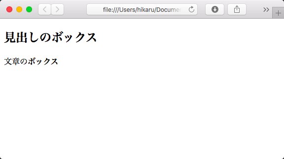
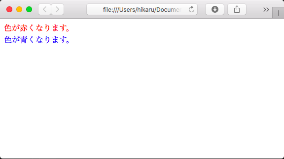

\newpage
\part{CSS基礎}

# CSSの基本を学ぶ

CSSとは、"Cascading Style Sheets"(カスケードスタイルシート)の略で、
HTMLと組み合わせることでページの見た目を装飾することができます。

## ボックスとブロック

ページにデザインを適用する場合は、ボックス（ブロック、かたまり）という単位で考えるとよいでしょう。  
ある範囲にボックスを作りたい場合は、下記のように divタグを使います。

```html:block.html
<div>
    <h2>見出しのボックス</h2>
    <p>
        文章の
        <b>
           ボックス
        </b>
    </p>
</div>
```



## ボックス要素とインライン要素

HTMLには様々なマークアップタグがありますが、
中でも表示に関するいくつかのタグがあります。
先ほどのコードを見ると、「見出しのボックス」と「文章のボックス」の間には自動で改行がされていますが、  
「文章の」と「ボックス」の間は改行されずに連続で表示されています。

この、自動で改行される要素を「ブロック要素」と言い、改行されないような要素を「インライン要素」と言います。  
インライン要素は、行内の一部を整形するために使用することがほとんどです。

そのため、このような場合に以下のようにコードを記載すると可読性が上がるでしょう。
変更しても、表示内容は全く同じになります。

```html:block.html
<div>
    <h2>見出しのボックス</h2>
    <p>文章の<b>ボックス</b></p>
</div>
```

まとめると、

|要素タイプ| 改行| タグの例|
|--------|----|--------|
|ブロック要素|される| h1~h6、p、ul、div など
| インライン要素| されない| b、a、span、label など

## 複数の記載方法

実際にHTML要素へスタイルを適用するためには、
下記に記載のように3種類の方法があります。
下記のコードは、実行するといずれも同じ内容を表示できます。

### HTMLタグに直接指定する

HTMLのタグ要素に直接指定します。
一箇所のみ指定したい場合など、手軽に指定することができます。

```html:style.html

　　〜

<div style="color:red;">
    色が赤くなります。
</div>

　　〜

```

### HTMLファイル内にstyleタグとして宣言する

style タグで指定した中に、スタイルを指定します。
ここでは、すべての div要素の中の文字を赤くするという記載になります。

この記載方法の場合、同じページ内すべての div要素内の文字が赤くなります。
そのため、ページ内で使い回しの効くスタイルを指定することができます。


```html:red.html
<head>
    <style type="text/css">
        div {
            color:red;
        }
    </style>
</head>
<body>

　　〜

    <div>
        色が赤くなります。
    </div>
</body>
```

### cssファイルを用意する

別ファイルとして「site.css」というファイルを作成し、
HTMLで読み込んで使用します。

HTMLファイル内に記載する場合と同じ動作をしますが、
ページを跨いで同じ表示形式をとりたい場合、一つのファイルを作成して書くページで同じcssファイルを読み込むだけで済みます。

```css:site.css
div {
    color:red;
}
```

```html:red.html
<head>
    <link rel="stylesheet" href="site.css">
</head>
　　〜
    <div>
        色が赤くなります。
    </div>
　　〜
```

### クラス指定

前項では、すべてのdiv要素に対するスタイル指定を紹介しましたが、
一部のdiv要素にのみ適用したい場合があります。

その場合には、要素の他にクラスを指定することで、
特定の要素に対してのみ適用できます。

```html:class.html
<!DOCTYPE html>
<html lang="ja">
<head>
    <meta charset="UTF-8">
    <link rel="stylesheet" href="site.css">
    <style type="text/css">
        .red {
            color:red;
        }

        .blue {
            color:blue;
        }
    </style>
</head>
<body>
    <div class="red">
        色が赤くなります。
    </div>
    <div class="blue">
        色が青くなります。
    </div>
</body>
</html>
```

実際に上記コードを実行すると、以下のようになります。



正常に赤と青が表示されましたでしょうか？

このように、クラス指定を組み合わせることで
より簡単にスタイルの指定をすることができます。

## CSS3 - 次世代のスタイルシート

### CSS3とモダンブラウザ

HTML5の登場に合わせ、
CSS3という概念が登場しました。
このCSS3は、従来のCSSと比較して大きく進歩しました。

それまでも、CSS上で綺麗な表現をすることは可能でしたが、
ブラウザ毎の実装となっており、各ブラウザに対応したCSSを指定する必要がありました。
このブラウザ毎の実装を「ベンダープレフィックス」と呼びます。

例として、テキストなどを変形させるCSSは以下になります。

```css
div {
     -webkit-transform: scale(2.5);
         -ms-transform: scale(2.5);
             transform: scale(2.5);
}
```

上から、Chrome/Safari、IE、CSS3の記述となります。

