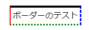
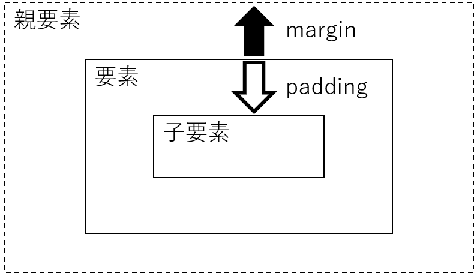
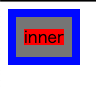
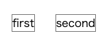
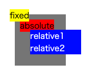
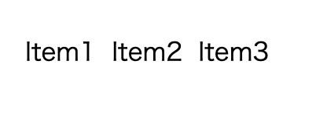
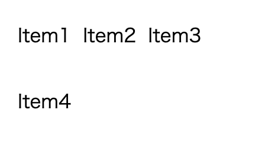

# 様々なスタイルを使ってみよう

## 基本となるスタイル

スタイルの基本スタイルは以下の通りです。

```css
セレクタ {
    設定名: 値;
}
```

## セレクタ

セレクタは、スタイルを適用するための条件式を記載します。
セレクタに記載した条件に合致したHTML要素に対して、スタイルが適用されます。

### 要素名セレクタ

pタグやaタグなど、タグの要素名から指定することができます。

例として、aタグの要素を変更します。

```css
a {
    color: red;
    font-size: large;
}
```

こうすることで、全てのa要素に対して上記のスタイルが適用されます。

### クラス名を指定しての指定

特定の要素にのみ指定を行いたい場合、クラス名を指定してスタイルを記載します。

```css:style.css
.red {
    color: red;
}

.green{
    color: green;
}
```

```html:index.html
<html>
<body>
    <div class="red">Red</div>
    <p class="green">Green</p>
</body>
</html>
```

クラス指定する場合には、要素に関わらず指定することができますが、  
例えば非インライン要素に対するvertical-alignなど、
要素によっては適用されない場合があります。

### 複数の要素からセレクタを構成する

セレクタを指定する際に、複数の条件を使用してセレクタとすることができます。

例として、「文字を赤くする」ための記載をします。

```css
div.red {
    color: red;
    font-weight: bold;
}

a.red {
    color: red;
    font-size: large;
}
```

```html:index.html
<html>
<body>
    <div class="red">Red</div>
    <br/>
    <a class="red">Red</a>
</body>
</html>
```

この場合、同じclass="red"を指定した場合でも、
divタグは文字が太くなり、aタグは文字が大きくなります。

このように、同じクラス名を使用する場合でも、
要素ごとに違った挙動をさせることができます。

\newpage

## 色を変更しよう

ここでは、色の変更を行います。

### 色名指定

CSSでは色名指定で表示できる色が用意されており、色の名称を指定することでその色を表示することができます。

以下に基本色となる16色を示します。

| |色名|RGB値|
|:--|--|--|
| \color[HTML]{00FFFF} ■ |aqua|#00FFFF|
| \color[HTML]{000000} ■ |black|#000000|
| \color[HTML]{0000FF} ■ |blue|#0000FF|
| \color[HTML]{FF00FF} ■ |fuchsia|#FF00FF|
| \color[HTML]{808080} ■ |gray|#808080|
| \color[HTML]{008000} ■ |green|#008000|
| \color[HTML]{00FF00} ■ |lime|#00FF00|
| \color[HTML]{800000} ■ |maroon|#800000|
| \color[HTML]{000080} ■ |navy|#000080|
| \color[HTML]{808000} ■ |olive|#808000|
| \color[HTML]{800080} ■ |purple|#800080|
| \color[HTML]{FF0000} ■ |red|#FF0000|
| \color[HTML]{C0C0C0} ■ |silver|#C0C0C0|
| \color[HTML]{008080} ■ |teal|#008080|
| \color[HTML]{FFFFFF} ■ |white|#FFFFFF|
| \color[HTML]{FFFF00} ■ |yellow|#FFFF00|

他にも、「拡張された色名」が124色存在しますが、ここでは説明を省略します。

### 16進数による指定

16進数を用いて、RGBの各値を0~FF(255)の範囲で表現することで色の指定を行うことができます。


### rgb()による指定

RGB値を10進数で指定したい場合には、rgb()関数を使用します。

```css
selector {
    color: rgb(255,0,0);
}
```

## フォントを指定する

表示する文字に関する指定を行います。

### font-family

フォント名を指定することで、
そのフォントで文字を表示させることができます。

### font-weight

フォントの太さを指定できます。

## 上下左右に寄せる

テキストを上下左右に寄せることができます。

### 左右に寄せる - text-align

テキストの左右位置を調整するには、text-alignを使用します。

よく使用される値は以下の通りです。

|値| 説明|
|--|--|
|left | 左端に揃える |
| right | 右端に揃える | 
| center | 中央に配置 | 

### 上下に寄せる - vertical-align

テキストの上下一を調整するには、vertical-alignを使用します。  
ただし、vertical-alignを適用できるのは、インライン要素とテーブルセルのみで、ブロックレベル要素には適用できませんので注意が必要です。

よく使用される値は以下の通りです。

|値| 説明|
|--|--|
| top | 上端に揃える |
| middle | 下端に揃える | 
| bottom | 中央に配置 | 

## 枠をつける - border

要素に枠を付けるには、borderを使用します。

### borderの基本形

borderの基本系は以下の通りです。

```css:border.css
.border {
    border: solid 1px black;
}
```

3つの値を指定することができ、それぞれ

1. ボーダースタイル
1. 太さ
1. 色

を指定できます。

スタイルの一例は以下の通りです。

| 値 | 説明 |
|--|--|
| none | 線なし |
| solid | 1本線 |
| double | 2本線 |
| dashed | 破線 |
| dotted | 点線 |

### 個別の指定

borderは上下左右それぞれで指定することもできます。

```css:border.css
.border {
    border-top: solid 1px black;
    border-left: double 2px red;
    border-right: dashed 1px blue;
    border-bottom: dotted 1px green;
}
```

表示すると以下のようになります。




### 各項目の個別指定

borderに関する設定は、スタイル、太さ、色をそれぞれ別で設定もできます。

```css
.border {
    border-style: solid; /** スタイル */
    border-color: red;   /** 色 */
    border-width: 2px;   /** 太さ */
}
```

上下左右の個別指定についても同様です。
top/left/right/bottomを入れることで個別に指定することができます。

```css
.border-top {
    border-top-style: solid;
    border-top-color: red;
    border-top-width: 2px;
}
```


## 余白

要素に対して余白を付与するためには、二つの方法があります。

- margin
- padding

marginは、「要素の外部」に対する余白、
paddingは、「要素の内部」に対する余白となります。

図にすると以下のようになります。

{width=300px}

例として、以下のようなcssを考えます。

```css
div {
  background-color: blue;
  display: inline-block;
}
p {
  padding: 8px;
  margin: 8px;
  background-color: gray;
}
span {
    background-color: red;
}
```

```html
<html>
  <body>
    <div>
      <p>
        <span>inner</span>
      </p>
    </div>
  </body>
</html>
```

この場合、以下のように表示されます。



p要素(灰色の背景部分)に対して設定したmarginおよびpaddingが反映されることで、
div要素(青い背景)、およびspan要素(赤い背景)の部分に対しての空白部分が生成されます。

### marginの相殺

marginで空白を指定した要素が並んだ場合に、それぞれで指定したmarginの値が相殺される場合があります。

例として、下記のようなスタイルを考えます。

```css
p{
  float: left;
  border: solid 1px gray;
  margin-left: 10px;
  margin-right: 20px;
}
```

```html
<html>
  <body>
    <div>
      <p>first</p>
      <p>second</p>
    </div>
  </body>
</html>
```

その際、以下のように表示されます。



この時、二つの要素の間には20pxの間隔が指定されています。
スタイルだけを見ると、left要素に10px、right要素に20pxをmarginを指定しているため、
合わせて30pxの間隔になるように思えますが、
margin同士は相殺されるため、大きい値である20pxが適用されることになります。

## 位置の指定方法

### position

positionを指定することで、要素の位置を親からみてどう配置するのかを設定することができます。
指定できるものとしては、以下のものがあります。

- absolute
- relative
- fixed
- static(標準、指定なしと同義)

試しに、それぞれの動きを見てみましょう。

```css
.box{
  position: absolute;
  top: 30px;
  left: 30px;
  width: 100px;
  height: 100px;
  background-color: gray;
}

p {
  margin: 0px;
}

.absolute {
  top: 10px;
  left: 10px;
  position: absolute;
  background-color: red;
}
.relative {
  top:30px;
  left:30px;
  position: relative;
  background-color: blue;
  color: white;
}
.fixed {
  top:20px;
  left: 20px;
  position: fixed;
  background-color: yellow;
}
```

```html
<html>
  <body>
    <div class="box">
      <p class="absolute">absolute</p>
      <p class="relative">relative1</p>
      <p class="relative">relative2</p>
      <p class="fixed">fixed</p>
    </div>
  </body>
</html>
```

実行すると、以下のようになります。



特徴をまとめると、以下のようになります。

#### relative

relativeは、「元々表示する位置からの相対距離」を指定することで表示位置をずらす事ができます。
そのため、例のように２つのrelativeを指定した場合、二つの要素が並んで(+30,+30)された場所に表示されます。

#### absolute

absoluteは「親要素を起点とした絶対位置」を指定します。
例の場合、親の左上を起点として(10, 10)の位置に表示しています。

#### fixed

relativeは、absoluteと同様に絶対位置を指定して配置しますが、
「親要素に関係なく、画面に対する絶対位置」で表示されます。

そのため、親要素の場所に関係のない配置がされますので構成に気をつける必要があります。

### float

通常、ブロック要素を複数個定義した場合には改行されるため縦並びに表示されます。
floatプロパティを使用することで、綺麗な横並びを実現できます。

```css
p {
  float: left;
  margin-left: 10px;
}
```

```html
<html>
  <body>
    <div class="container">
      <p>Item1</p>
      <p>Item2</p>
      <p>Item3</p>
    </div>
  </body>
</html>
```

実行すると、以下のように表示されます。



このように、floatを使用することで綺麗な横並びを実現できます。
なお、float:right;を指定することで、右を基準とした並びをすることもできます。

#### floatのクリア

floatを解除する場合、以下のような記載をすることで解除する事ができます。

```css
p {
  float: left;
  margin-left: 10px;
}

p:last-child {
  clear: left;
}
```

```html
<html>
  <body>
    <div class="container">
      <p>Item1</p>
      <p>Item2</p>
      <p>Item3</p>
      <p>Item4</p>
    </div>
  </body>
</html>
```

実行すると以下のように表示されます。



cssにて「p:last-child」に対してclear:leftを指定していますが、
この「last-child」は、「pの中の最後の要素」を表しています。

つまり、「最後のp要素のみfloatを解除する」ことになります。

## 疑似クラス

さて、:last-childという見慣れない単語が登場しました。
これを「疑似クラス」と呼び、指定したクラスや要素に対する特別な状態に対してのみスタイルを指定することができます。

よく使われる疑似クラスには以下のようなものがあります。

### マウスなどの状態で指定

マウスやキーボードなどの移動に関してスタイルを指定することができます。

|疑似クラス| 説明|
|:--|:--|
|:hover  | マウスが要素の上にある時 | 
|:active | アクティブな状態(マウスでクリックされている状態) |
|:focus  | 要素にフォーカスが当たっている時 |

### リンクに関する指定

a要素に対し、リンク先が訪問済か未訪問かでスタイルを変更することができます。

|疑似クラス| 説明|
|:--|:--|
|:link  | 未訪問リンクに対するスタイル指定 | 
|:visited | 訪問済みリンクに対するスタイル指定 |

### 列挙項目に関する指定

同じタグまたはクラスが並ぶ場合に特定の要素に対してスタイルを指定することができます。
主にテーブルやリストなどに適用できます。

|疑似クラス| 説明|
|:--|:--|
|:first-child|連続する要素の最初|
|:last-child|連続する要素の最後|
|:nth-of-type(x)|x番目の要素|
|:nth-of-type(odd|even)|oddとしたときは奇数行目、evenとしたときは偶数行目|

例えば、テーブル要素のうち、偶数行のみ色を変えたい場合には以下のような指定ができます。

```css
tr:nth-of-type(even) {
  background-color: gray;
}
```

## 複数のスタイルを指定したときの挙動

### 同じ要素に対する指定

もし、一つのCSSの中で、同じ要素に対して複数回のスタイル指定があった場合にはどうなるのでしょうか。
例として、以下のようなCSSを考えてみます。

```css
<style>

a.link {
  color: black;
}

a.active {
  color: yellow;
}

a {
  color: red;
}

a {
  color: blue;
}

</style>

<a href="#">リンク１</a>
<a class="link" href="#">リンク２</a>
<a class="active link" href="#">リンク３</a>
```

リンク１の文字は青で表示されます。
このように、スタイルの指定が衝突した場合には、あとに記載された内容で上書きされていきます。

一方、リンク２の文字は黒で表示されます。
要素とスタイルの両方が指定されている場合には、順番にかかわらずそちらが優先されるためです。

スタイルの優先順位としては以下のようになります。

```
要素#ID > #ID > 要素.クラス > .クラス > 要素 > *
```

なお、要素.クラスのスタイル指定で衝突した場合にはどうなるのでしょうか。
リンク３は、a.activeとa.linkの両方をクラスに指定しています。

実際に表示すると、クラス３は黄色で表示されます。

同じレベルのスタイル指定をした場合には、前述の通りスタイルシート記載の順番で決まります。

この場合、a要素へはactiveとlinkが指定されていますが、
スタイルシートの順序はlink->activeの順で記載されているため、activeに記載された黄色が優先されます。