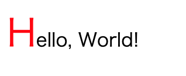
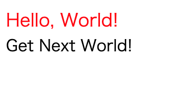
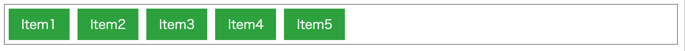
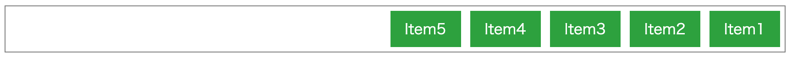
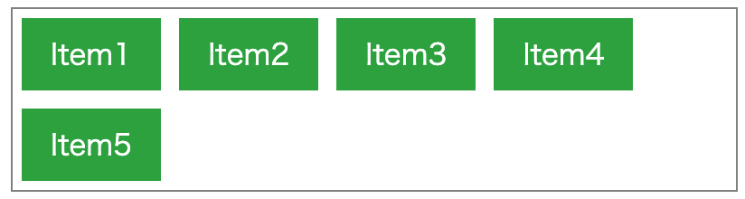
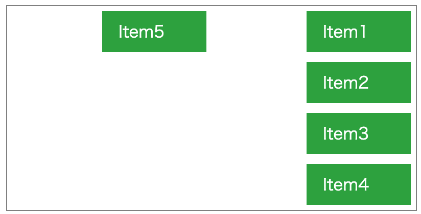
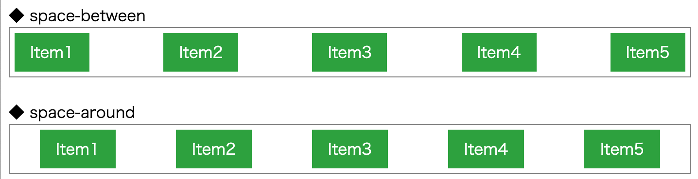
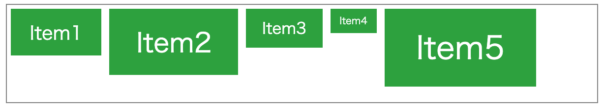
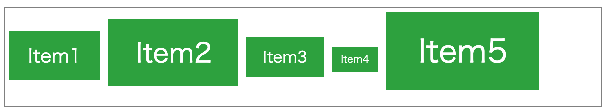
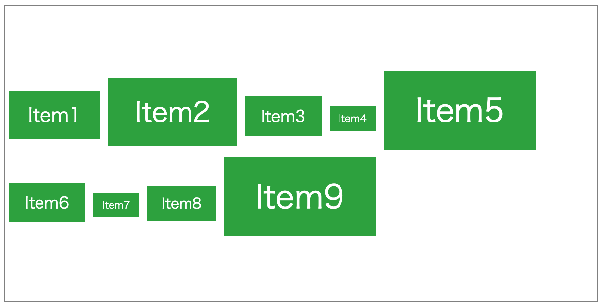

# さらに便利なCSSを使いこなす


## 疑似クラス

さて、前回:last-childという見慣れない単語が登場しました。
これを「疑似クラス」と呼び、指定したクラスや要素に対する特別な状態に対してのみスタイルを指定することができます。


よく使われる疑似クラスには以下のようなものがあります。

### マウスなどの状態で指定

マウスやキーボードなどの移動に関してスタイルを指定することができます。

|疑似クラス| 説明|
|:--|:--|
|:hover  | マウスが要素の上にある時 |
|:active | アクティブな状態(マウスでクリックされている状態) |
|:focus  | 要素にフォーカスが当たっている時 |

### リンクに関する指定

a要素に対し、リンク先が訪問済か未訪問かでスタイルを変更することができます。

|疑似クラス| 説明|
|:--|:--|
|:link  | 未訪問リンクに対するスタイル指定 |
|:visited | 訪問済みリンクに対するスタイル指定 |

### 列挙項目に関する指定

同じタグまたはクラスが並ぶ場合に特定の要素に対してスタイルを指定することができます。
主にテーブルやリストなどに適用できます。

|疑似クラス| 説明|
|:--|:--|
|:first-child|連続する要素の最初|
|:last-child|連続する要素の最後|
|:nth-of-type(x)|x番目の要素|
|:nth-of-type(odd|even)|oddとしたときは奇数行目、evenとしたときは偶数行目|

例えば、テーブル要素のうち、偶数行のみ色を変えたい場合には以下のような指定ができます。

```css
tr:nth-of-type(even) {
  background-color: gray;
}
```

このように、擬似クラスを使いこなすことで、
CSSのみで複雑なデザインを実現できます。

## 擬似要素

擬似クラスの他に、擬似要素と呼ばれるセレクタが存在します。

擬似クラスは特定の状態に対して適用できるのに対し、
擬似要素は特定の要素自体に対してスタイルを適用できます。

概念としては別物になりますが、概ね同じような使い方ができます。
今回は、よく使われる擬似要素について解説します。

擬似クラスは、「:擬似クラス名」で指定しますが、擬似要素は「::擬似要素名」のように::（コロン2つ）で指定します。

### ::first-letter

子要素の一文字目に対して特定のスタイルを指定します。

◆ CSS

```css
p::first-letter {
  font-size: large;
  color: red;
}
```

◆ HTML

```html
<p>Hello, World!</p>
```

表示すると、以下のようになります。



### ::first-line

子要素の１行目に対して特定のスタイルを指定します。

◆CSS

```css
p::first-line{
  font-size: large;
  color: red;
}
```

◆ HTML

```html
<p>
  Hello, World!
  <br />
  Get Next World!
</p>
```

表示すると、以下のようになります。



### ::before / ::after

beforeは前に、afterは後ろに、特定の要素を追加できます。

たとえば、contentで文字を指定することで、その文字列を表示できます。

◆CSS

```css
p::before{
  color: red;
  content: '◆◆◆'
}
p::after {
  color: red;
  content: '◆◆◆'
}
```

◆ HTML

```html
<p>Hello, World!</p>
```

表示すると、以下のようになります。


このように、CSSで特定の要素を追加することもできます。

擬似的な要素が追加されますので、
特定の大きさのブロックを配置することもできます。

### 擬似クラスと擬似要素の見分け方

中身については理解できましたが、結局擬似クラスと擬似要素の違いがイマイチ分からない方も多いかと思います。

「こんなものだ」と覚えても一向に構いませんが、簡単に解説すると以下の違いがあります。

擬似要素は指定した要素の内部で条件が決定する
擬似クラスは指定した要素の外部で条件が決定する

たとえば、擬似クラスの:first-childは、tr要素などに設定します。
しかしながら、初めの要素かどうかはtr要素には依存せず、その外部のtable(tbody/thead)要素に依存します。

一方で、擬似要素のfirst-lineは設定した要素の子要素に対して効力を発揮します。
そのため、その外側に何があっても影響は受けません。

## Flexboxを使いこなす

従来のCSSでは、前述の通りtext-alignやvertical-align、postition、floatなどといったスタイルを活用して位置関係を指定してきました。

今回は、CSS3により新しく制定されたFlexboxのうち、配置に関する部分をピックアップして解説します。

### Flexboxの対応状況

Flexboxは、CSS3で制定された新しいスタイルです。
2020年現在でサポートされているブラウザを利用する分には問題ありませんが、
サポーが切れているような古いブラウザでは正常に動作しない場合があります。

もし、古いブラウザ（11より古いIE）への対応が必要な場合にはとくに注意が必要です。

### Flexboxの基本構文

まずは、Flexboxの基本形を紹介します。

◆CSS

```css
.container {
  display: flex;
}

.container div {
  margin: 5px;
  padding-left: 1em;
  padding-right: 1em;
  padding-top: 0.5em;
  padding-bottom: 0.5em;
  color: white;
  background-color: #2fa134;
}
```

◆ HTML

```html
<div class="container">
  <div>Item1</div>
  <div>Item2</div>
  <div>Item3</div>
  <div>Item4</div>
  <div>Item5</div>
</div>
```

表示すると、以下のようになります。



Flexboxは、並び方を指定したい親要素に対して

```css
display: flex;
```

を指定することで利用できます。

このように、display: flex; とほぼ同じような使い方ができますが、Flexboxはさらに柔軟な使い方ができます。

### 配置する方向を指定する

Flexboxでは、``flex-direction``を用いて配置する方向を指定できます。

```css
flex-direction: row;
```

|設定値|説明|
|:---|:---|
|row|水平方向に左から右へ配置する（デフォルト）|
|row-reverse|水平方向に右から左へ配置|
|column|垂直方向に上から下へ配置|
|column-reverse|垂直方向に下から上へ配置|

たとえば、row-reverseを指定すると以下のようになります。



### 要素の折り返しを指定

Flexboxの大きな特徴として、はみ出した分を自動で折り返すことができます。

```css
flex-wrap: nowarp;
```

|設定値|説明|
|:--|:--|
|nowrap|子要素を折り返さずに1行で並べる（デフォルト）|
|warp|子要素を折り返しながら上から下へ配置していく|
|wrap-reverse|子要素を折り返しながら下から上へ配置していく|

たとえば、wrap指定すると以下のようになります。



このように、要素がはみ出す場合には次の子要素を自動で折り返すようになります。

また、flex-directionとflex-warpを組み合わせることで、縦書きのような配置にすることも可能です。

```css
.container {
  height:200px;
  width: 400px;
  display: flex;
  flex-direction: column;
  flex-wrap: wrap-reverse;
  border: solid 1px gray;
}
.container div {
  width:70px;
  margin: 5px;
  padding-left: 1em;
  padding-right: 1em;
  padding-top: 0.5em;
  padding-bottom: 0.5em;
  color: white;
  background-color: #2fa134;
}
```

このCSSを適用すると、以下のようになります。



このように、flex-flowとflex-directionはセットで使用することが多いです。

Flexboxにはflex-flowというスタイルが用意されています。
これにより、これらの2つの設定をまとめて1つのスタイルとして指定できます。

```css
flex-flow: column wrap;
```

### 水平方向の配置の配置

水平方向の配置には、justify-contentを使用します。

```css
justify-content: center;
```

|設定値|説明|
|:--|:--|
|flex-start|開始位置から順に配置|
|flex-end|終了位置から順に配置|
|flex-center|中央に配置|
|space-between|均等に配置する。ただし、最初と最後の子要素は両端に配置する。|
|space-arond|最初と最後の要素も含め、均等に配置するする。|

同じ均等配置であるspace-betweenとspace-aroundを比較してみましょう。
表示してみると、以下のようになります。



space-aroundは、Item1の左とItem5の右にもスペースが置かれています。
この空白は、ちょうどItem1とItem2の間隔の半分です。
これらの使い分けは、「左右にスペースをおきたいかどうか」によって決めると良いでしょう。

### 垂直方向の配置

垂直方面の配置には、align-itemsを使用します。

```css
align-items: center;
```

|設定値|説明|
|:--|:--|
|streth|親要素の高さ、または同列要素の一番大きなものに合わせる（デフォルト）|
|flex-start|親要素の上揃え|
|flex-end|親要素の下揃え|
|center|中央に配置|
|baseline|ベースラインに揃える|

ここでポイントになるのがベースラインです。
ベースラインとは、文章を構成する際に基準となるラインで、このベースラインを揃ることで見栄えがよくなります。

◆ flex-start


◆ baseline


このベースラインは、文章として読みやすく構成する場合に利用します。
そのため、配置した要素が文章として意味をなす場合には、可読性を上げるためにもベースラインを利用した方良いでしょう。

### 垂直方向の配置の配置（複数行）

align-itemsは単数行の指定に使用していましたが、
垂直方向の配置には、align-contentを使用します。

```css
align-content: center;
```

|設定値|説明|
|:--|:--|
|flex-start|開始位置から順に配置|
|flex-end|終了位置から順に配置|
|flex-center|中央に配置|
|space-between|均等に配置する。ただし、最初と最後の子要素は両端に配置する。|
|space-arond|最初と最後の要素も含め、均等に配置する。|

配置に関する基本的な考え方はjustify-contentと同様です。

#### 垂直方向の配置を組み合わせる

``align-content``と``align-items``は組み合わせて使用できます。
例として、以下のようなCSSを作成してみましょう。

◆ CSS

```css
.container {
  height:300px;
  width: 600px;
  display: flex;
  flex-direction: row;
  flex-wrap: wrap;
  border: solid 1px gray;
  align-content: center;
  align-items: baseline;
}

.container div {
  padding-left: 1em;
  padding-right: 1em;
  padding-top: 0.5em;
  padding-bottom: 0.5em;
  margin: 4px;
  color: white;
  background-color: #2fa134;
}
```

◆ HTML

```html
<div class="container">
  <div style="font-size: 1.2em;">Item1</div>
  <div style="font-size: 1.7em;">Item2</div>
  <div style="font-size: 1em;">Item3</div>
  <div style="font-size: 0.6em;">Item4</div>
  <div style="font-size: 2em;">Item5</div>
  <div style="font-size: 1em;">Item6</div>
  <div style="font-size: 0.6em;">Item7</div>
  <div style="font-size: 0.9em;">Item8</div>
  <div style="font-size: 2em;">Item9</div>
</div>
```

ポイントは以下の2行です。

```css
  align-content: center;
  align-items: baseline;
```

表示してみると、以下のようになります。



全体としてはalign-contentの中央が、各行ではalign-itemsのベースラインが適用されています。
このように、単数と複数行の設定を組み合わせることで、自在なレイアウトを実現できます。

### 子要素に対する垂直方向設定

コンテナ（親要素）に対して垂直方向の位置設定をすることもできます。

```css
align-self: flex-start;
```

|設定値|説明|
|:--|:--|
|auto|コンテナ（親要素）のalign-items設定を継承|
|streth|親要素の高さ、または同列要素の一番大きなものに合わせる|
|flex-start|親要素の上揃え|
|flex-end|親要素の下揃え|
|center|中央に配置|
|baseline|ベースラインに揃える|

設定できる項目は``align-items``と同等のため省略します。
``align-items``で設定されたアイテムのうち、一部分のみの設定を書き換えたい場合に使用します。
