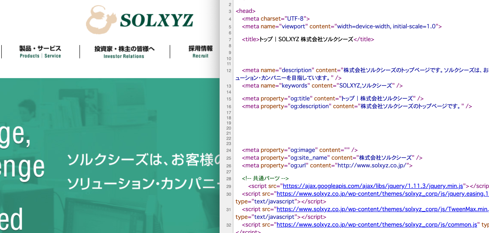

## HTMLの基礎知識

### HTMLとは？

HMTLとは、"Hyper Text Markup Language"（ハイパーテキスト・マークアップ・ランゲージ）の略で、
Webページを作成する為に使用する基本的なマークアップ言語のひとつです。

## どうやってWebページを作っているのか？

ブラウザから任意のWebサイトを開き、右クリックメニューから
「ページのソースを表示」(ブラウザによって表現が異なります)を選択します。

すると、``<html>``などから始まる文字列情報が表示されます。
これがHTMLのソースコードです。

JavaScriptフレームワークやJSP(Java)やASP.NET(C#)なども、
最終的にはこのHTMLコードを作成することでブラウザ上で見れるようになります。
