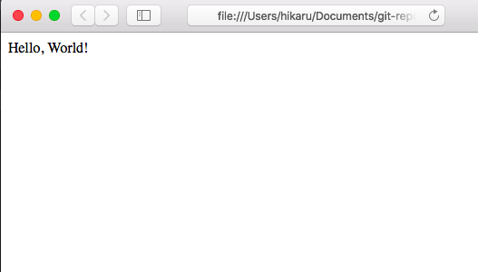
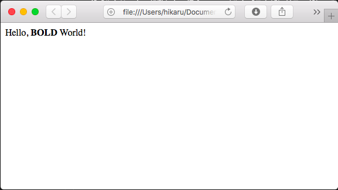
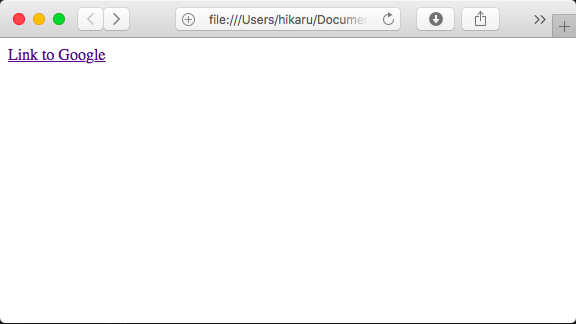
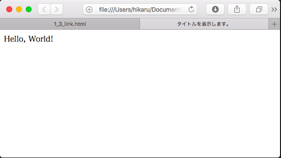

# HTML基礎

## HTMLの基礎知識

### HTMLとは？

HMTLとは、"Hyper Text Markup Language"（ハイパーテキスト・マークアップ・ランゲージ）の略で、
Webページを作成する為に使用する基本的なマークアップ言語のひとつです。

## どうやってWebページを作っているのか？

ブラウザから任意のWebサイトを開き、右クリックメニューから
「ページのソースを表示」(ブラウザによって表現が異なります)を選択します。

すると、<html>などから始まる文字列情報が表示されます。
これがHTMLのソースコードです。

JavaScriptフレームワークやJSP(Java)やASP.NET(C#)なども、
最終的にはこのHTMLコードを作成することでブラウザ上で見れるようになります。

## HTMLファイルを作ってみよう

### 文字を表示してみよう

実際に動いているWebページのソースコードは色々と書かれていましたが、
基本的にはテキストデータです。

試しに、下記のようなファイル「hello.html」を作成してみましょう。

```html:hello.html
Hello, World!
```

さて、このhello.htmlファイルをダブルクリックして見ましょう。
下記のような画面が表示されましたか？
<br>
ダブルクリックで起動しない場合、ファイルをブラウザにドラッグしてみましょう。



さて、ここまでできたらHTMLの基礎ができました。

### 初めてのマークアップ

文字を表示することはできましたが、
世の中のWebサイトはもっと華やかだったり別なページに移動できたりしますよね。
これを実現する為に利用するのが「マークアップ」です。
次は、マークアップによる装飾を行います。

以下のようなコードを書いて、同様にブラウザで実行してみましょう。

```html:bold.html
Hello, <b>BOLD</b> World!
```



「BOLD」の文字だけが太く表示されましたでしょうか？
<br>この「\<b\>」が「太くする」マークアップ記号となります。


マークアップ記号は、基本的に<br>
<記号>〜</記号>
の形で記載し、その囲った中に影響を及ぼします。

## 他のページへ遷移する

他のページへ移動するには、\<hr\>というマークアップを使用します。
<br>
早速以下のようなコードを書いて、ブラウザで見て見ましょう。

```html:link.html
<a href="https://google.com">Link to Google</a>
```

表示された「Link to Google」をクリックすると、Googleへ遷移します。
今回は外部のサイトを指定しましたが、内部サイトへのリンクも同じ使い方ができます。



## HTMLに必要な共通情報

一番はじめにWebサイトのソースコードを見ましたが、
画面には直接現れない、見慣れない箇所が
コードのはじめの箇所に記載されていたかと思います。

次に、この記載を学習します。
まずは以下のコードを書いてブラウザで表示しましょう。

```html:header.html
<!DOCTYPE html>
<html lang="ja">
<head>
    <meta charset="UTF-8">
    <meta name="viewport" content="width=device-width, initial-scale=1.0">
    <meta http-equiv="X-UA-Compatible" content="ie=edge">
    <title>タイトルを表示します。</title>
</head>
<body>
    Hello, World!
</body>
</html>
```

さて、一見一番初めに書いたHello, Worldと全く同じ内容が表示されていますね。




これだけ見ると、あまり意味がないのでは？と思ってしまうかもしれませんが、
それ以外のところでとても意味を持ってきます。
簡単に、本当に重要な箇所だけ紹介します。

#### \<\!DOCTYPE html\>

このファイルがHTMLファイルですよ、という宣言のために記載します。
<br>
必ず記載する必要がありますので、現状はおまじない程度と思っていただいて構いません。

#### \<html lang="ja"\>

この\<html\>タグで囲った部分をHTMLのマークアップとして認識しますよ、という宣言です。

また、「lang="ja"」という記載が最重要で、このページは日本語を取り扱っています、
という宣言をしています。
<br>
これがないと、日本語を正常に表示できなくなります。

#### \<head\>

この\<head\>タグで囲った部分は、ヘッダ情報を表します。
ヘッダ情報とは、そのHTMLファイル内で共通の設定情報を保持するブロックで、
ページの表示に関わる様々な情報を記載します。

#### \<meta charset="UTF-8"\>

文字コードをUTF-8とするための記載です。
特に、日本語を使用する場合には必ず指定してください。
指定しない場合、ブラウザが文字コードが判別できずに文字化けを起こす可能性があります。

Windowsのみを対象としたWebサイトではShift-JISを指定することもありましたが、
近年ではスマートフォンやMac、Linuxといった様々なOSが一般化したため、
UTF-8を採用することが多くなりました。

#### \<title\>タイトルを表示します。\</title\>

そのページのタイトルを指定します。
<br>
例えば、タイトルはタブブラウザで表示したときにタブに表示されます。

表示イメージを見ると、タブの部分に「タイトルを表示します。」と表示されていることが確認できます。

#### \<body\>

\<body\>タグは、そのファイルの本文であることを表します。
<br/>
表示内容に関するマークアップはこの\<body\>~\</body\>の間に記載します。

### マークアップの入れ子構造

マークアップの特性上、内容をタグで囲んで行くため、
大きければ大きいほど入れ子が深くなります。
<br/>
そのため、可読性向上のため、一般的にはタグが入れ子になるたびにインデントを増やします。
以下は書き方の一例です。

```html:nest.html
<tag1>
    <tag2>
        <tag4>Content<tag4>
        <tag5>Value</tag5>
    </tag2>
</tag1>
```
