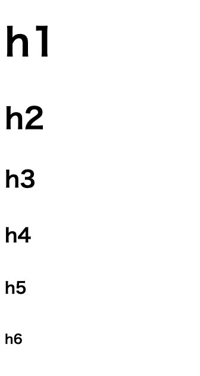
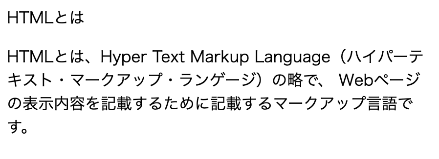

# HTML基礎 基本的なマークアップを覚えよう

## 表示に関する簡単なタグ

### ブロック要素

ブロック要素は、ひとまとめとなるような大きな要素や、区切りに使用します。

#### ヘッダ要素(h1〜h6)

ヘッダ要素は、各セクションなどのヘッダを表示するために使用します。
ヘッダはh1~h6まで存在し、それぞれに応じた大きさで表示されます。

```html
<h1>h1</h1>
<h2>h2</h2>
<h3>h3</h3>
<h4>h4</h4>
<h5>h5</h5>
<h6>h6</h6>
```

表示すると、以下のようになります。  


#### 段落(p)

一つの段落(Paragraph)を表す要所として、pタグを使用します。

```html
HTMLとは
<p>
HTMLとは、Hyper Text Markup Language（ハイパーテキスト・マークアップ・ランゲージ）の略で、
Webページの表示内容を記載するために記載するマークアップ言語です。
</p>
```

これをブラウザ上で表示すると以下のようになります。



このように、改行と共に空白を開けて文章が表示されます。

### div

divは、ブロック要素の基本となる要素で、
ヘッダや段落のように単体としての意味を持たない代わりに、特有のスタイル(自動で付与される余白など)を一切持ちません。

内包する要素をブロック要素として扱うということに特化していますので、
もっとも扱いやすいブロック要素と言えます。

### インライン要素

インライン要素は、主にブロック要素の中に配置する要素で、文章の一部として扱います。

### span

spanタグは、インライン要素のグルーピングに使われるタグで、
単体では大きな意味を持ちません。

## 画像を表示する

<div style="page-break-before:always"></div>

## フォーム入力と入力要素

HTMLを学習する上で、切っても切れない関係にあるのが、「フォーム」と「入力要素」です。

サーバなどに情報を送信する際に、データの入力を行う固まりをフォームと呼びます。

### フォームの基本形

フォームを構成するには、入力項目を\<form\>要素で囲むことで実現します。

```html
<form method="POST" action="/submit">
    <input type="text" name="input1" placeholder="入力１">
    <input type="text" name="input2" placeholder="入力２">
    <input type="submit" value="送信">
</form>
```

form要素に下記の属性を指定することで、サーバにデータを送信できます。

|属性名|説明|
|--|--|
|method| HTTPメソッドを指定(POSTまたはGET)|
|action| 送信するサーバーのURLを指定|

### 入力要素

入力する内容に応じて、様々な入力様式を提供します。

**共通**

|属性名|説明|
|--|--|
|name|サーバに送信される際のキーを指定|
|value|送信される値を格納(入力に応じて値が変化)|

#### input

inputは、基本となる入力要素で、入力するための要素を構成します。

属性にtype="xxx"とする事で、様々な入力制限をかける事ができます。
typeを省略した場合、デフォルトでtextになります。

**type="text"**
文字の入力を行うための1行のテキストボックスを表示します。
typeを指定しない場合、デフォルトでtextとなります。

**type="password**
パスワードボックスを表示します。
入力文字が"*"や"●"などに置き換わって表示されるため、
ユーザは入力内容を画面上から確認する事ができません。

**type="checkbox"**
チェックボックスを表示します。

**type="radio"**
ラジオボタンを表示します。

**type="file"**
送信するファイルを指定するコントロールを表示します。

**type="hidden"**
隠し情報をサーバに送信する際に使用します。
画面には表示されませんが、指定した情報をサーバへ送信します。

**type="submit"**
押下時にサーバにデータを送信(Submit)します。

**type="reset"**
押下時に、全ての入力情報をクリアします。

**type="image"**
画像のボタンを表示します。
画像(img)要素と同様に、src属性で画像のパスを指定します。

#### label

labelは、フォーム要素に対する項目名を紐づけるために使用します。

主にラジオボタンやチェックボックスとセットで使用します。
例として、ラジオボタンを考えます。

```html
<form>
  <input type="radio" id="radio" name="radio"><label for="radio">ラベル</label>
</form>
```

実行すると以下のようになり、「ラベル」の部分を謳歌してもその横にあるラジオボタンを選択できるようになります。


この際、ラジオボタンのid属性名とラベルのfor属性の名前を一致させる事で、紐付けを行う事ができます。

id属性はその要素を一意に決めるために使用します。特別な理由がない限り一意となるような値を設定してください。

## テーブル

テーブルを表示するには、\<table\>タグを使用します。

テーブルの基本形が以下になります。

```html
<table>
    <thead>
        <tr>
            <th>ヘッダ１</th>
            <th>ヘッダ２</th>
            <th>ヘッダ３</th>
        </tr>
    </thead>
    <tbody>
        <tr>
            <td>項目１−１</td>
            <td>項目１−２</td>
            <td>項目１−３</td>
        </tr>
        <tr>
            <td>項目２−１</td>
            <td>項目２−２</td>
            <td>項目２−３</td>
        </tr>
        <tr>
            <td>項目３−１</td>
            <td>項目３−２</td>
            <td>項目３−３</td>
        </tr>
    </tbody>
</table>
```

表示すると以下のようになります。

<table>
    <thead>
        <tr>
            <th>ヘッダ１</th>
            <th>ヘッダ２</th>
            <th>ヘッダ３</th>
        </tr>
    </thead>
    <tbody>
        <tr>
            <td>項目１−１</td>
            <td>項目１−２</td>
            <td>項目１−３</td>
        </tr>
        <tr>
            <td>項目２−１</td>
            <td>項目２−２</td>
            <td>項目２−３</td>
        </tr>
        <tr>
            <td>項目３−１</td>
            <td>項目３−２</td>
            <td>項目３−３</td>
        </tr>
    </tbody>
</table>

各要素は、それぞれ以下の意味を持ちます

**theadとtbody**
theadはヘッダー部分を、tbodyはデータ部を表します。

**tr**
trは行を表します。

**thとtd**
thとtdはセルを表しますが、thはヘッダセル、tdはデータセルを表します。

## リスト

HTMLでは、リストを表示するための方法がいくつかあります。
本項では、それらの表示方法を解説します。

### 順序のないリストの表示

順序のないリスト要素を表示するためには、ulとliを使用します。

```html
<ul>
  <li>Item1</li>
  <li>Item2</li>
  <li>Item3</li>
  <li>Item4</li>
  <li>Item5
    <ul>
      <li>Item5-1</li>
      <li>Item5-2</li>
      <li>Item5-3</li>
    </ul>
  </li>
</ul>
```

表示すると、以下のようになります。
ul要素を入れ子にすることで、インデントと共に子要素を構成する事もできます。

<ul>
  <li>Item1</li>
  <li>Item2</li>
  <li>Item3</li>
  <li>Item4</li>
  <li>Item5
    <ul>
      <li>Item5-1</li>
      <li>Item5-2</li>
      <li>Item5-3</li>
    </ul>
  </li>
</ul>

### 番号を持ったリストの表示

番号付きのリストを表示する場合、olタグを使用します。
基本的な使い方はulと同じです。

```html
<ol>
  <li>Item1</li>
  <li>Item2</li>
  <li>Item3</li>
  <li>Item4</li>
  <li>Item5
    <ol>
      <li>Item5-1</li>
      <li>Item5-2</li>
      <li>Item5-3</li>
    </ol>
  </li>
</ol>
```

表示すると、以下のようになります。
ul要素と違い、olごとに順番が振られるため注意が必要です。

<ol>
  <li>Item1</li>
  <li>Item2</li>
  <li>Item3</li>
  <li>Item4</li>
  <li>Item5
    <ol>
      <li>Item5-1</li>
      <li>Item5-2</li>
      <li>Item5-3</li>
    </ol>
  </li>
</ol>

### 定義リストの表示

定義と、それに対する説明文や項目といった内容を表示する場合には、
dl要素を使用する事ができます。

ulやolと利用方法が異なるため注意が必要です。

```html
<dl>
    <dt>果物</dt>
    <dd>りんご</dd>
    <dd>みかん</dd>
    <dd>いちご</dd>
    <dt>
    <dt>野菜</dt>
    <dd>ナス</dd>
    <dd>かぼちゃ</dd>
    <dd>スイカ</dd>
</dl>
```

表示すると以下のようになります。

<dl>
    <dt>果物</dt>
    <dd>りんご</dd>
    <dd>みかん</dd>
    <dd>いちご</dd>
    <dt>
    <dt>野菜</dt>
    <dd>ナス</dd>
    <dd>かぼちゃ</dd>
    <dd>スイカ</dd>
</dl>