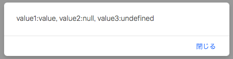

# JavaScript基礎学習

## JavaScriptとは

JavaScriptは、主にWebブラウザ上で動作するスクリプト言語です。

なお、"Java"の名を冠してはいるが、
サン・マイクロシステム社(現在はOracle社）が開発したJavaとの互換性等はありません。

# JavaScriptにできること

JavaScriptは、主にブラウザ上で表示されるHTML要素の操作に使用されます。

以下に、サンプルとして幾つかの使用例を紹介します。


# サンプルを用いた解説

## サンプル１　テキストボックスの中身を変更する

ボタンを押下した際にテキストの文字を操作するサンプルです。
まずは全体のHTMLコードを見てみましょう。

``` html

<!DOCTYPE html>
<html lang="ja">
<head>
    <meta charset="UTF-8">
    <meta name="viewport" content="width=device-width, initial-scale=1.0">
    <meta http-equiv="X-UA-Compatible" content="ie=edge">
    <title>Sample1 </title>
</head>
<body>
    <script>
        function replaceText(){
            // HTMLエレメントを取得
            var elem = document.getElementById("textval");
            // テキストの後ろに更に"こんにちは。"を結合
            elem.value += "こんにちは。";
        }
    </script>

    <form>
        <input id="textval" type="text" value="こんにちは。"/>
        <input type="button" value="変更" onclick="replaceText()"/>
    </form>

</body>
</html>

```

実行すると、テキストとボタンが表示されます。
ボタンを押下するたびに、テキストの中身に「こんにちは。」が足されていきます。

### 関数の定義

まずは、文字列を操作するための”関数”を定義します。


HTML内にJavaScriptを宣言する場合、
"<script>〜</script>"内で囲んで記載したコードがJavaScriptとして認識されます。


```javascript
<script>
  〜ここに処理を書く〜
</script>

```


実際の関数を宣言してみましょう。

``` javascript

<script>
    function replaceText(){
        // HTMLエレメントを取得
        var elem = document.getElementById("textval");
        // テキストの後ろに更に"こんにちは。"を結合
       elem.value += "こんにちは。";
    }
</script>

```

document.getElementById("textval")で、IDが"textval"を持つHTML要素を取得します。
<br>
このtextarea要素は「elem」という名前の「オブジェクト」としてロードされます。
<br>
以降は、このelemのプロパティや関数にアクセスすることができます。


次に、elem.valueでテキストボックスの値を変更します。
今回は”+="を使用しているため、現在の文字列の末尾に文字を追加しています。

### 関数を呼び出すための処理

それでは、この関数を呼び出すための書き方を紹介します。

```html
 <input type="button" value="変更" onclick="replaceText()"/>

```

onclickを使用することで、ボタン要素がクリックされた際の動作を指定できます。
今回は、先ほど作成した"replaceText"を呼び出すため、上記のように指定をします。


### まとめ：JavaScriptを宣言するために

- "＜script＞"タグで囲む
- 関数を宣言
- 実行するためのイベントをHTML要素に指定


## サンプル２　テキストが空の場合ボタンを押下不可能とする

実践的なサンプルとして、「不要なサブミットはさせない」ということを実現します。

全体のHTMLは以下になります。

```html
<!DOCTYPE html>
<html lang="ja">
<head>
    <meta charset="UTF-8">
    <meta name="viewport" content="width=device-width, initial-scale=1.0">
    <meta http-equiv="X-UA-Compatible" content="ie=edge">
    <title>Sample2 </title>
</head>

<body>
    <script>
        function checkInput(val) {

            // 送信ボタン
            var button = document.getElementById("submitButton");

            // テキストボックスの中身が空かどうか
            if (!val.value) {
                // 空の場合、非活性とする
                button.setAttribute("disabled", "disabled");
            } else {
                // 中身がある場合、活性(非活性を除去)する
                button.removeAttribute("disabled");
            }
        }

        function onSubmit() {
            alert("送信ボタンが押されました。");
        }

    </script>
    <form>
        <input id="textval" type="text" value="" onkeyup="checkInput(this)" />
        <input id="submitButton" type="button" value="送信" onclick="onSubmit()" disabled="disabled" />
    </form>
</body>
</html>

```

大まかな構成はサンプル１と同じです。

### 活性/非活性を切り替えるHTML属性を操作する

以下のコードを用いることで、HTML要素の属性を操作します。

属性の活性情報を操作するためには、 "disabled"要素を操作します。
操作するためのJavaScriptは以下になります。

#### 非活性とするためのコード

属性"disabled"="disabled"をセットするため、
「setAttribute」を用いてセットします。

``` javascript
button.setAttribute("disabled", "disabled");

```

#### 活性とするためのコード

非活性情報を除去するため、「removeAttribute」を用いて"disabled"タグを取り除きます。

``` javascript
 button.removeAttribute("disabled");

```

このように、動的にHTMLの属性を操作することができるのがJavaScriptの強みです。

まとめ：JavaScriptでの要素操作
- HTML要素を取得し、属性値などを操作できる
- 追加・削除する項目はHTMLの書き方に準拠


## サンプル３　JavaScriptでHTML要素を作成する


JavaScriptは、HTML要素の属性操作だけではなく、
HTML要素自体の作成をすることもできます。


```html
<!DOCTYPE html>
<html lang="ja">
<head>
    <meta charset="UTF-8">
    <meta name="viewport" content="width=device-width, initial-scale=1.0">
    <meta http-equiv="X-UA-Compatible" content="ie=edge">
    <title>Sample3 </title>
</head>

<label><span id="nums">0</span>件が選択されています。</label>
<hr/>
<div id="container">

</div>

<script>
    /** チェックされている個数 */
    var count = 0;

    function onChecked(val) {
        // チェックされているか
        if(!!val.checked) {
            count++;
        }else{
            count--;
        }

        var nums = document.getElementById("nums");
        nums.innerText = count;
    }

    /** 画面がロードされた際に呼び出される関数 */
    window.onload = function () {
        // ID "container"を取得
        var container = document.getElementById("container");

        // 5件のチェックボックスを作成
        for (i = 1; i <= 5; i++) {
            // "innerHTML"に代入することで、チェックボックスを追加
            container.innerHTML += 
                  "<input id='check_"+ i +"' type='checkbox' onchange='onChecked(this)'/>"
                + "<label for='check_"+i+"'>チェックボックス"+i+"</label>"
                + "<br/>";
        }
    }

</script>
</html>
```

実行すると、以下のように5つのチェックBOXが表示されます。

### 画面表示時の操作 - onloadの指定

まず、画面が表示されると同時にJavaScriptを実行するようにします。
以下のようなJavaScriptコードを記載することで、
「HTMLのロードが完了された時点」で、関数ないに記載したコードを実行します。

```javascript
window.onload = function(){

}
```

### HTML要素の作成

HTML要素を追加している箇所は以下になります。

```javascript
container.innerHTML += 
                  "<input id='check_"+ i +"' type='checkbox' onchange='onChecked(this)'/>"
                + "<label for='check_"+i+"'>チェックボックス"+i+"</label>"
                + "<br/>";

```
上記のコードが実行されると、以下のようなHTML要素が生成されます。(i=1の場合)

```html
<input id='check_1' type='checkbox' onchange='onChecked(this)'/>
<label for='check_1'> チェックボックス1</label>
<br/>
```

HTMLの意味合いは割愛しますが、サンプル２との違いは、関数「onChecked」に対して「this」を渡しているということです。

JavaScriptでは、「this」がとても大きな意味を持ちます。
この場合、関数に対して「this」を渡す場合、その時点要素自身を指すため、
input要素が関数に対して渡されます。

関数「onChecked」では、引数の「val」に対して操作を行なっていますが、
ここでは「選択されたinput要素（チェックボックス）」をvalとしてコードが実行されることになります。

<div style="page-break-before:always"></div>

### Javascriptのnullとundefined

JavaScriptでは、「値がない」ことを表すための表現が複数あります。
それが「null」と「undefined」です。

「null」皆さんがご存知の通りのnullを表す記号です。

それに対し、「undefined」は「宣言されていません」ということを表します。

例えば、以下のコードがあったとします。
<br>
alertは、引数の文字列をアラートとして表示する構文です。

```html
<!DOCTYPE html>
<html lang="ja">
<head>
    <meta charset="UTF-8">
    <title>Document</title>
</head>
<body>
    <script>
        // 確認するオブジェクト
        var dictionary = {
            value1 : "value",
            value2 : null,
        };

        // Value1〜3の内容を確認する
        alert("value1:" + dictionary.value1
             + ", value2:" + dictionary.value2
             + ", value3:" + dictionary.value3);

    </script>
</body>
</html>
```

実行すると、以下のようなアラートが表示されましたでしょうか。



JavaScriptでは、オブジェクトに宣言されていない項目にアクセスしてもエラーとはなりません。
その代わり、宣言されていない・または初期化されていない項目はnullではなく「undefined」として取得されます。
<br>
特に、JavaScriptにて値を取得する際にその項目がnullなのかundefinedかどうか判別するのは非常に難しいです。

例えば、「何かしらの値が入っている」という判定文をJava言語などの他言語で表現する場合、

```Java
if (value != null && !value.equals("")){ }
```

と記載しますが、JavaScriptで同じif文を記載すると「undefined」の場合にtrueとなってしまいます。

JavaScriptでは「値がない」(nullかundefinedか空文字)ということをもっと簡単に記載することができます。
<br>
以下の記載とするだけで、JavaScriptでは「値がない」と判断します。

```javascript
if (!value) { }
```

つまり、「何かしらの値があること」を判定するための文は以下になります。

```javascript
if (!!value) { }
```

このように、JavaScriptならではの表現をすることで、
考慮漏れを防ぎつつコードの短縮をすることができます。


### まとめ：JavaScriptでなんでもできる

- JavaScriptを使えば、HTML要素自体を作って追加することができる。
- "this"は自分を表す最強の予約語

## サンプル４　jQueryの登場

近年では標準化されたため、ほとんどのブラウザで同様の挙動を行いましたが、
ブラウザによって実装が異なるため一部ブラウザでは動作しない、
ということが度々発生していました。

それを受けて、2006年に jQuery が登場しました。

jQueryはその使いやすさから、多くのWebデベロッパーに好まれて使用されてきました。

```html
<!DOCTYPE html>
<html lang="ja">
<head>
    <meta charset="UTF-8">
    <meta name="viewport" content="width=device-width, initial-scale=1.0">
    <meta http-equiv="X-UA-Compatible" content="ie=edge">

    <!-- jQueryのロード -->
    <script src="https://code.jquery.com/jquery-3.3.1.min.js"></script>

    <title>Sample4 </title>

    <style>
        /** IDを指定してのスタイル指定 */
        #container {
            color: black;
            width: 15em;
            height: 2em;
            padding-top: 0.5em;
            text-align: center;
            vertical-align: middle;
        }

        /** 要素名を指定してのスタイル指定 */
        button {
            border:blueviolet solid 2px; 
        }

        /** 色情報 */
        .red {
            background-color: red;
        }

        .blue {
            background-color: blue;
        }

        .yellow {
            background-color: yellow;
        }
    </style>

    <script>
        
        function doRed() {
            $("#container").removeClass("blue");
            $("#container").removeClass("yellow");
            $("#container").addClass("red");
        }

        function doBlue() {
            $("#container").addClass("blue");
            $("#container").removeClass("yellow");
            $("#container").removeClass("red");
        }

        function doYellow() {
            $("#container").removeClass("blue");
            $("#container").addClass("yellow");
            $("#container").removeClass("red");
        }

        $(function() {
        	// 各ボタンにonclickのイベントをバインドS
        	$("#redBtn").on("click", doRed);
           $("#blueBtn").on("click", doBlue);
           $("#yellowBtn").on("click", doYellow);
        });
    </script>
</head>

<body>

    <div id="container">
        中身です。
    </div>
    <br/>
    <button id="redBtn" class="red">赤くする</button>
    <button id="blueBtn" class="blue">青くする</button>
    <button id="yellowBtn" class="yellow">黄色くする</button>


</body>

</html>
```

jQueryの大きな特徴は、セレクタ（HTML要素の抽出）にあります。
今まで、document.getElementById()を使用していましたが、
以下の構文だけで要素を抽出できます。

```javascript
$("#container").removeClass("blue");

```

また、サンプル３で紹介したwindow.onloadも、以下の記載で同じことが実現できます。

``` javascript
$(function() {
    // 〜ここに処理〜
});
```

他にもjQueryは多くの機能を備えていますが、
ここでは割愛します。

### まとめ：jQueryとは
- HTML要素の操作が簡単に実現できる
- 2018年現在でも多くのWebサイト、Webアプリで使われている

