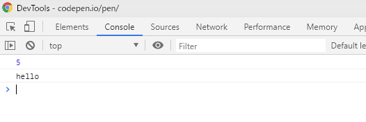

\newpage
\part{JavaScript基礎}

# JavaScript基礎学習

## JavaScriptとは

JavaScriptは、主にWebブラウザ上で動作するスクリプト言語です。

なお、"Java"の名を冠してはいますが、
サン・マイクロシステム社(現在はOracle社）が開発したJavaとの互換性等はありません。

## JavaScriptにできること

JavaScriptは、主にブラウザ上で表示されるHTML要素の操作に使用されます。

以下に、サンプルとして幾つかの使用例を紹介します。

# JavaScriptの基本構文

本章では、JavaScriptの基本的な構文を学びます。

## 変数と定数の定義

変数は、varで定義することができます。

```javascript
var a = 5;
console.log(a);
```

## JavaScriptのコードを書く準備

まずは、以下のようなhtmlファイルを作成します。

```html
<!DOCTYPE html>
<html lang="ja">
<head>
    <title>JavaScript</title>
</head>
<body>
<script>

</script>
</body>
</html>
```

HTML内にJavaScriptを宣言する場合、
"<script>〜</script>"内で囲んで記載したコードがJavaScriptとして認識されます。

```javascript
<script>
  〜ここに処理を書く〜
</script>

```

## 変数と定数

まずは、変数を用意して表示してみましょう。

```javascript
var number = 5;
var char = "hello";

console.log(number);
console.log(char);
```

console.logは、コンソール出力を表します。
ブラウザでこのログを表示するためには、開発者コンソールを開きます。

WindowsでIE/Edge/Chromeを使用している場合、
F12キーを推すと開発者コンソールを開くことができます。

コンソールを開くと、以下のように出力されているかと思います。



### 新しい変数の概念

varで宣言した変数は、他の言語とはスコープの概念が少し異なりました。

例として、以下のようなコードを考えます。

```javascript
var x = 1;

if (x === 1) {
    var x = 2;
    var y = 3;
}

console.log(x);
console.log(y);
```

C言語をはじめとするコンパイル言語では、
同名関数の定義でエラーになるか、スコープ内でのみ有効な変数が再生成されます。

しかしながら、JavaScriptのvarは再宣言が可能であり、定義が共有されるため、
このような書き方をしてもxは同じものとして扱われます。


その後、ES2015よりletとconstが登場し、
これにより、スコープごとに有効な変数と定数の定義が可能になりました。  
なお、IE9など古いブラウザでは動きませんので注意してください。

letはスコープ内の変数宣言に、constは定数宣言に使用することができます。

まとめると以下のようになります。

| 名称 | スコープ | 再宣言 | 再代入 |
|-----|----------|-------|--------|
| var   | グローバル | ○ | ○ |
| let   | ブロック   | × | ○ |
| const | ブロック   | × | × |


## JavaScriptの基本構文を学ぶ

JavaScriptの基本構文の書き方はJava言語とさほど変わりません。
簡単な書き方を学びます。

### 条件分岐

#### if文

IF文の書き方は以下のようになります。

```javascript
if (x === 0) {
    // ここに処理
}
```

この時、気を付けなければならないのは、「===」で比較を行っている点です。
JavaScriptの比較は数値に変換して実施するため、文字列の比較も内部的には数値に変換しようとします。

そのため、以下のような比較をしようとすると同じ値とされてしまいます。

```javascript
var a = 5;
var b = "5";

if (a == b) {
    console.log("aとbは同じ。");
}
```

そのため、型も含めて比較を行いたい場合には、イコールを3つ並べて比較を行います。

リクエストパラメータの処理などで、あえて数値と文字を同じとするような手法もありますが、
誤ったコーディングを防止する目的でも、なるべく「===」による比較を行いましょう。

### switch文

## ループ

### for文

### foreach文

#### リストの定義

### while文

